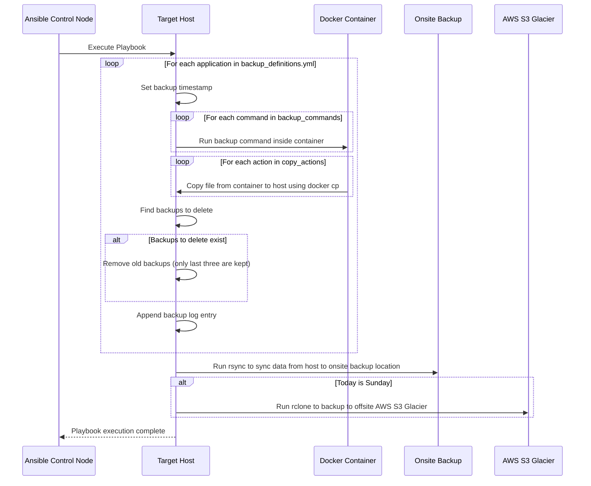

## Build the backup node image
```shell
docker build -f ansible/backups/Dockerfile -t backup-node .
```

## Run the backup node container
Make sure to create the ```vault.pass``` and ```ssh.key``` files before running the container. 
```shell
docker run \
    --name=containers-backup-node \
    -d \
    -e ANSIBLE_HOST_KEY_CHECKING=False \
    -v path/to/vault.pass:/ansible/vault.pass:ro,Z \
    -v path/to/container/host/ssh/key:/ansible/container_host_ssh.key:ro,Z \
    -v /etc/localtime:/etc/localtime:ro \
    backup-node
```
